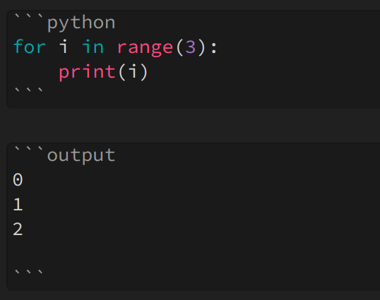

* * *

date updated: '2020-06-22'
version: 0.0.4

* * *

# Run Snippets plugin

This plugin allows you to run Python, Javascript etc, snippets from inside obsidian.md

It's intended for simple uses, like starting a service, running a program, etc. I've tested this only in Linux, and is experimental.

The plugin reads your 'snippet plugin settings' that contain the configuration for each language.

## Usage

### Preview mode

The plugin shows a 'run' button for a recognized (shell) snippet.


If you click, firefox opens.

## Edit mode

1.  Place your cursor on top of a code snippet.


2.  press `Ctrl/Cmd`+`Shift`+`Enter`, or select the `Snippets: Run` command from the palette

The code will (hopefully) run, and any outputs will be appended after the snippet.


You can also invoke some python!



## Vars

The following placeholders are recognized:

|                |                           |
| -------------- | ------------------------- |
| {{vault_path}} | path of the vault         |
| {{folder}}     | name of the folder        |
| {{file_name}}  | Name of the file          |
| {{file_path}}  | absolute path of the file |

### Example

```sh
echo {{vault_path}} 
echo {{folder}} 
echo {{file_name}} 
echo {{file_path}}
```

```output
/home/cvasquez/obsidian
snippets-plugin
readme.md
/home/cvasquez/obsidian/snippets-plugin/readme.md
    
```

## Config

This is the config by default. It contains one entry for each language.

```json
{
  "python": {
    "template": "python3 -c \"{{src}}\"",
    "showModal": true,
    "appendOutputContents": true,
    "showRunButtonInPreview": true
  },
  "javascript": {
    "template": "node -e \"{{src}}\"",
    "showModal": true,
    "appendOutputContents": true,
    "showRunButtonInPreview": true
  },
  "sh": {
    "template": "{{src}}",
    "showModal": true,
    "appendOutputContents": true,
    "showRunButtonInPreview": true
  }
}
```

### Attributes

|                        |                                        |
| ---------------------- | -------------------------------------- |
| Template               | {{src}} will be replaced               |
| showModal              | shows the output in a modal            |
| appendOutputContents   | writes the output after the code fence |
| showRunButtonInPreview | shows the button in the preview mode   |
| options                | [additional options](https://nodejs.org/api/child_process.html#child_process_child_process_exec_command_options_callback) such as shell or encoding|

### Default shell

The default shell is '/bin/sh' on Unix and process.env.ComSpec on Windows. Other shells can be configured using the 'options' attribute.

Example that uses powershell: 

```json
  "sh": {
    "template": "{{src}}",
    "options": {"shell":"powershell.exe"},
    "showModal": true,
    "appendOutputContents": true,
    "showRunButtonInPreview": true
  }
```

## Manual installation

Install dependencies

    npm install

Generate main.js bundle

    npm run build

Copy main.js, manifest.json and styles.css to your vault's plugins folder, 
under [YourVaultFolder]/.obsidian/plugins/review-obsidian/.

## Observations

This prototype is super experimental; I've written it because I wanted to use python inside obsidian.

## Developers

Pull requests are both welcome and appreciated. :)

## Version


### 0.0.4

-   Added javascript option.
-   Added shell options.
-   No errors when markdown view is not present.

Thanks to: 
* [catworld](https://github.com/catword)
* [mgmeyers](https://github.com/mgmeyers)
